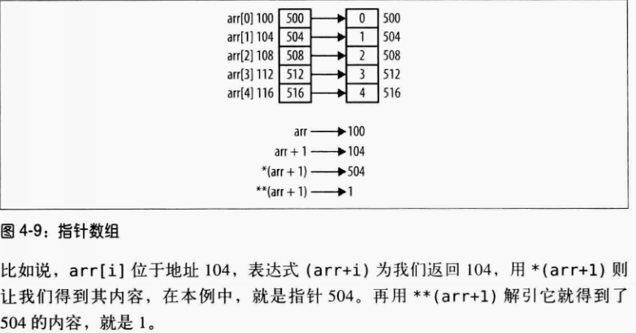
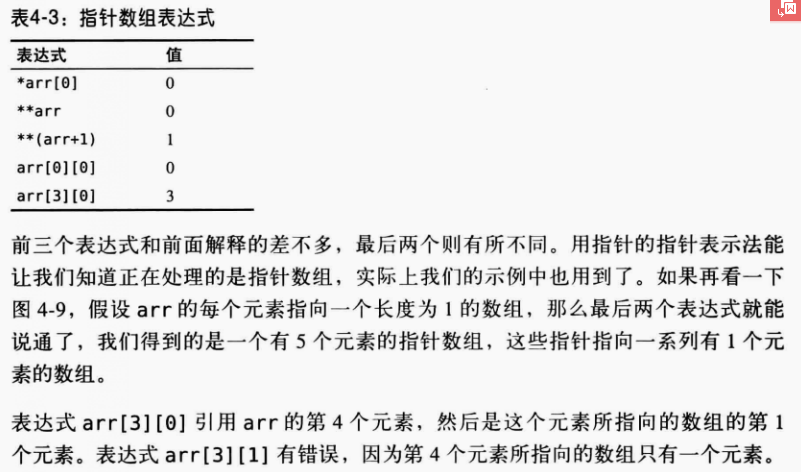
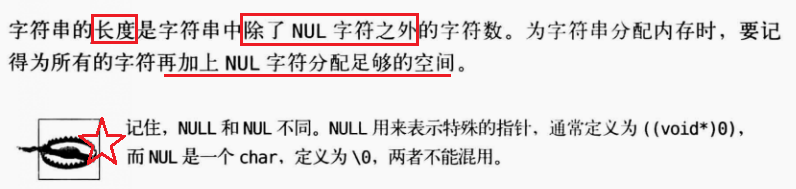
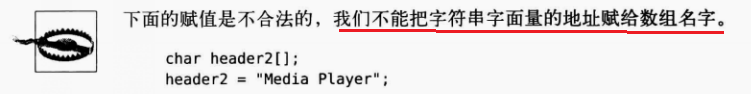
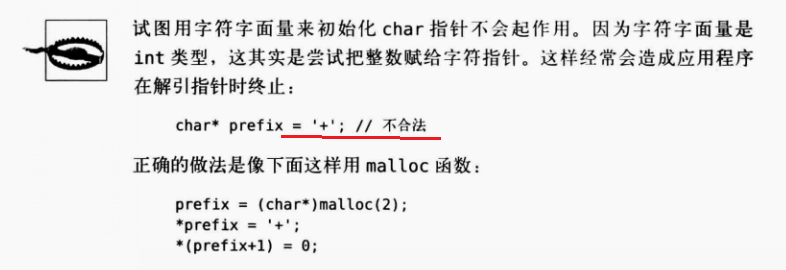

# 指针
##指针差值
差值为两个指针之间相差的 ++**单位**++ 数，差的符号取决于操作数的顺序
##指针比较
指针和数组元素相比较时，比较结果可以判定数组元素的  **相对顺序**
##常量指针（**const**  修饰）
不能通过指针修改指针引用的值
#####->指针指向的对象的值不能改变
#####->指针指向的对象可以改变
#####->数据类型和const 关键字的顺序不重要
const int *p;
int const *p;
两者等价
```
const  int num=5;
int num_2=6;
int * p;
const  int *p_2;
p=&num;
*p=8;//(错误->p指向对象为 num，num-> const修饰)
p=&num_2;//（正确 ->修改指针指向对象）
p_2=&num_2;
*p_2=8;//(错误 ->指针const修饰->常量指针,指针认为自己指向的是整数常量)
num_2=8;//(正确，通过修改指针指向对象修改指针指向对象的值)
```

#####-> int *const p;
p:指向非常量的常量指针
->p指向的int对象不能为const修饰
->p不能被修改
->p指向的int对象的数据可以修改
```
int numl
int *const p=&num;
*p=10;//(正确)
const int num_3=10;
p=&num_3;//(语法正确，出现waring initialization discards qualifiers from pointer target type)
int num_4;
p=&num_4;(错误，“p:you cannot assign to a variable that is const ")
```
##迷途指针
	内存已经释放，而指针还在引用原始内存->迷途指针
    如果访问内存，行为不可预期，内存可能重新分配，数据不是之前的
    如果内存不可访问， 则是段错误
```
int *pi = (int *) malloc(sizeof(int));
int num6=8；
pi=&num;
free(pi);
```

######free(pi)执行瞬间
->free(pi)后，pi指向的对象（num）的内存释放（还给堆），但pi还是指向num内存起始地址
，num内存还没有被分配，数据仍为8，此时pi为迷途指针

```
	int *pi;
    {
    int tmp =6;
    pi=&tmp;
    }
    //pi变成迷途指针-> tmp内存释放，可能被其他使用，如fun()函数
    fun();
```
##程序栈
->支持 **函数** 执行的内存区域，通常和堆共享内存区域
->程序栈存放 **栈帧 **,栈帧 存放 **函数参数** 和 **局部变量**
-> 栈帧==活跃记录（activation record)==活跃帧（activeation frame)
##指针与函数
>将指针传递给函数时，传递的是指针的值，如果想修改原指针而不是指针的副本，就需要传递指针的指针
##free函数
 >传入参数：指向指针的指针
 >void 类型可以传入所有类型指针
```
void saferFree(void **pp)
{
	if(pp !=NULL && *pp != NULL)
    {
      free(*pp);
      *pp=NULL;
    }
}
```

**优化**

```
#define safeFree(p)  saferFree((void **) &(p))
```

##函数指针
>函数指针是持有函数地址的指针
####声明
````
void （*fun)();
````
->接受void,返回void
->void :返回类型
->fun:函数指针变量名
->（）：参数
```
	int *f();//f为一个函数，返回一个整数指针，可改写为 int *  f();
    int (*f2)();//f2为函数指针，返回一个整数
    int * (*f3)();//f3为函数指针，返回一个整数指针
```
##数组和指针
**单独使用数组名字会返回数组地址**
```
	int  vector[5] = {1,2,3,4,5};
    int *pv =vector;
```
——>指针pv指向的是数组的第一个元素
**返回数据地址的方式**
——>数组名字
——>对数组的第一个元素用取地址操作符
```
	int  vector[5] = {1,2,3,4,5};
	int *pv;
    pv=vector;//整数指针
    pv=&vector[0];//整数指针
    pv=&vector'/获取数组的地址复制给pv
```
——>pv[i] **等价于** ` *(pv+i)`//指针加减为一个**单位长度**（指针指向的对象的长度）**等价于** `*（vector +i)`
**数组和指针的差别**
```
	int  vector[5] = {1,2,3,4,5};
    int *pv =vector;
	int iLenth=sizeof(vector);//20   数组分配的字节数
    int iLenth2=sizeof(pv);//4  指针的长度 
    pv=pv+1;//正确
    vectorvector+1;//错误
```
——>左值表示赋值操作符左边的符号，左值必须能修改，pv为左值
——>数组名字不是左值，不能修改，不能改变数组所持有地址，但指针可以赋值新值引用不同内存段

##指针数组
```
 int * arr[5];
 for(int i=0;i<5;i++)
 {
 	arr[i] =(int *)malloc(sizeof(int));
    *arr[i] =i;
 }
```

——> arr[i]:表示指针
——> `*arr[i]`:指针指向的值

**等价、高级写法**
```
*（arr+i) =(int *)malloc (sizeof(int));
 **(arr+i) =i;
```
——>(arr+i):指针数组第i个元素的地址
——>`*(arr+i)`:指针数组第i个元素的地址的内容
——>`**(arr+i)`:指针数组第i个元素存放对象的地址



##指针和字符串
——>字符串以ASCII 字符NUL结尾的字符序列，ASCII字符NUL表示\0.
*NULL和NUL的区别*
——>NULL: 定义为 0 或者 0L 或者 （void*）0，用于指示一个指针的值是空，即什么都不指。NULL是一个宏，它在几个标准头文件中定义
——>NUL： 0x00, 0的字符值，用于结束ASCII字符串。NUL 是ASCII 字符集中 '\0' 字符的名字，它的字节模式为全 0
——>0是一个整型常量，'\0'是一个字符常量，而NUL是一个字符常量的名字

````
1、NULL用于表示什么也不指向，也就是`空指针((void *)0)
2、0可以被用于任何地方，它是表示各种类型零值的符号并且编译器会挑出它
3、'\0'应该只被用于结束字符串
4、NUL没有被定义于C和C++，它不应该被使用，除非你自己定义它，像：#define nul '\0'
5、空指针：值是NULL , NULL可能是0，0L 或 (void*)0 ，一个空指针应该明确，它不是任何对象或函数的地址
```

***字符串初始化***


用**malloc**为字符串分配内存时：
要加上终结符NUL
**不用sizeof**计算字符串长度，** 用strlen计算**

####strlen和sizeof区别
strlen：函数
sizeof:单目运算符
```
char str[]="hello";
int num1=strlen(str);//5，不包含结束符（'\0')
int num2 =sizeof(str);//6

```
####char指针初始化
