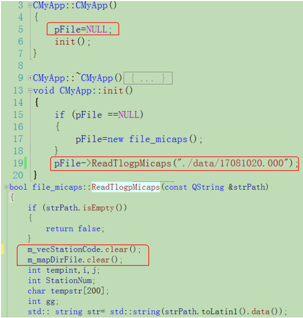
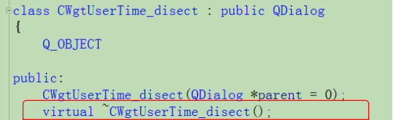
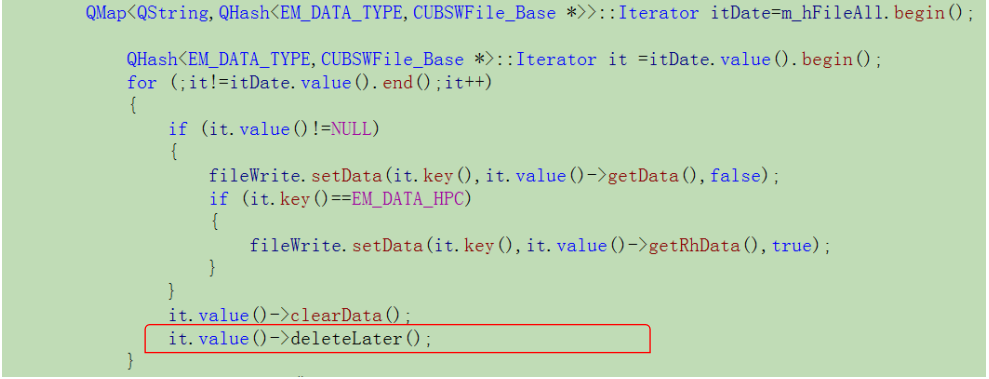
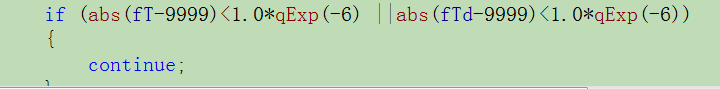

#踩坑日记
1. 指针声明后没有初始设置为NULL，指针不为NULL->如果是类指针，p->fun（）(函数）调用时可进入函数，
函数内的变量可正常使用，但类的成员变量因为没有初始化，调用错误，程序崩溃

2. 基类的析构函数不加virtual，子类继承基类，子类销毁时进入子类析构函数，但不进入基类析构函数
  构造：基类—>子类
  析构：子类->基类
  
3. vector\map 等容器内存放指针对象,容器clear ，指针对象内存不释放
  
4. float 相等判断：利用差值判断
    科学计数法方式表示的浮点数。
	通用形式为AeB
	其中，A可以为任意实数。 e可以写作E。 B必须是整数。
	表示A乘10的B次幂。
	1e-6就是1乘10的-6次幂，也就是0.000001	
	由于float有效位为6~7位， 所以1e-6经常被用作float类型运算的精度值
 