#踩坑日记

#### 指针声明后没有初始设置为NULL，指针不为NULL->如果是类指针，p->fun（）(函数）调用时可进入函数，函数内的变量可正常使用，但类的成员变量因为没有初始化，调用错误，程序崩溃

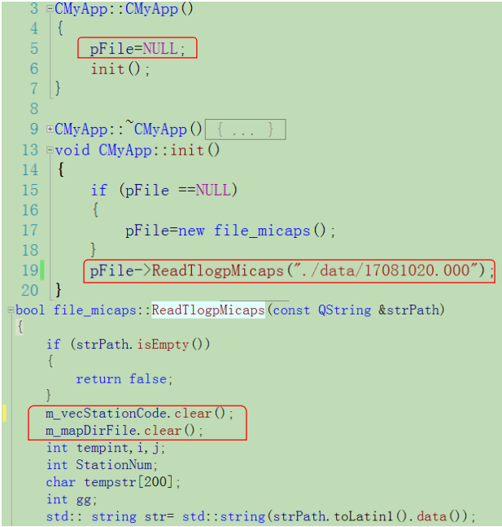

#### 基类的析构函数不加virtual，子类继承基类，子类销毁时进入子类析构函数，但不进入基类析构函数

  构造：基类—>子类

  析构：子类->基类

  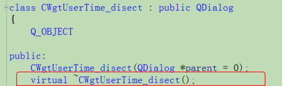

#### vector\map 等容器内存放指针对象,容器clear ，指针对象内存不释放

  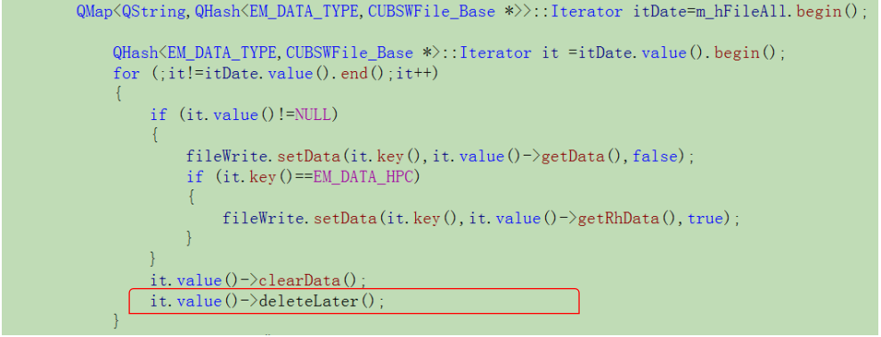

#### float 相等判断：利用差值判断

    科学计数法方式表示的浮点数。

	通用形式为AeB

	其中，A可以为任意实数。 e可以写作E。 B必须是整数。

	表示A乘10的B次幂。

	1e-6就是1乘10的-6次幂，也就是0.000001	

	由于float有效位为6~7位， 所以1e-6经常被用作float类型运算的精度值

 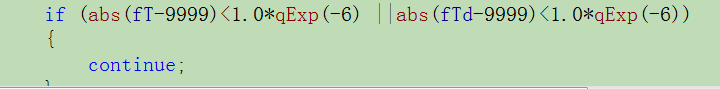

####union关键字

    uninon维护足够的空间来放置多个数据成员 中的**一种**，而不是为每一个数据成员提供空间。

    在uninon中的所有数据成员公用一个空间，同一时间只能存放其中一个数据，所有的数据成员具有

    相同的起始地址

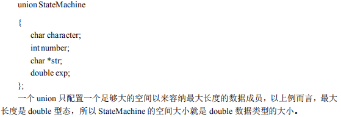

#### 野指针
	**函数说明**： 该函数设计功能将类SVALUE数据以二进制形式保存到文件
    问题：207行  指针sValue通过new的方式申请了内存，用于存放待保存数据
    211行实现保存数据，
    sValue：存放数据的内存地址
    &sValue:指针sValue自身的内存地址
    sizeof(sValue): 指针大小，始终为4
    故:实际保存的是指针自身的地址，不是数据
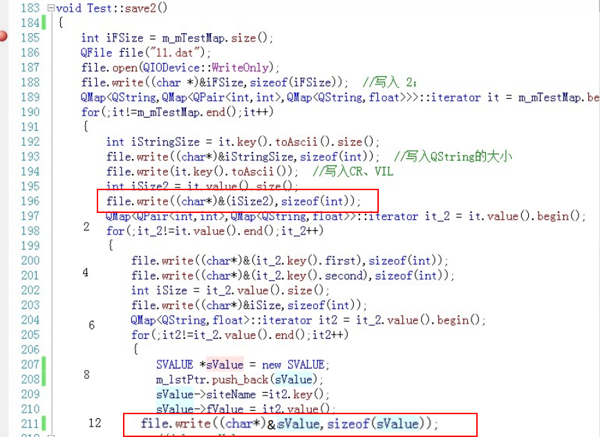
**函数说明**：读取前面存放在文件中的二进制数据
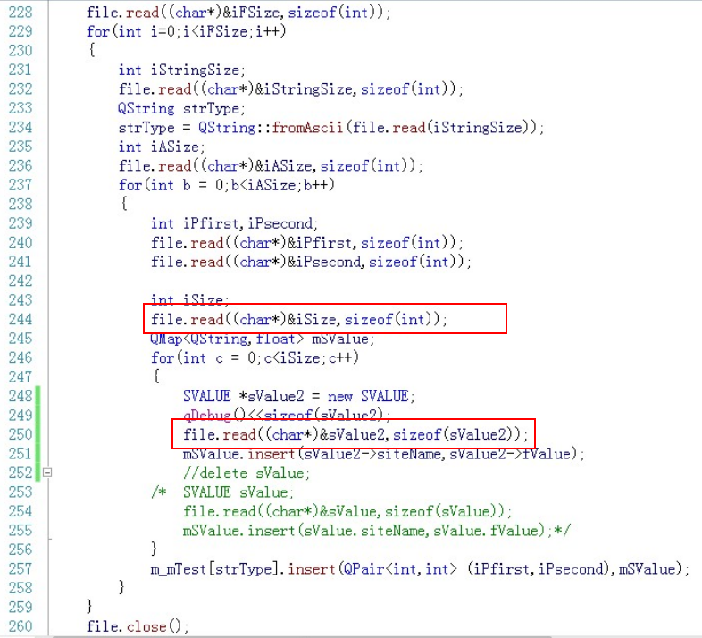
**出现问题**：
**情况1：当调用保存函数，紧接着调用读取函数，数据能读出**
**情况2：当调用保存函数，生成二进制文件，退出程序。屏蔽保存函数，启动程序执行读取函数，程序在244行崩溃**
**问题分析**
情况1：保存函数执行后申请内存没有立即释放，存放的是指向数据的指针的地址，执行读取函数时从文件读取的4字节地址刚好是前面存放数据的指针的地址，虽然读取的地址为指针地址且此指针为野指针，但之前内存没释放，恰好是之前的数据
情况2：执行读取函数时从文件读取的4字节地址是上次程序中存放数据的指针的地址，程序关闭，内存已经释放，当再将读取的地址作为指针自身地址，访问指针指向数据地址时，地址非法，故程序崩溃
####   c++ 中struct中成员默认为public,sizeof(struct)或者sizeof(class)时，当虚构函数不加vurtual 时为成员的长度，添加vurtual 增加了一个指向函数列表的指针，故大小加4，成员函数的增加或成员函数添加virtual 不影响大小
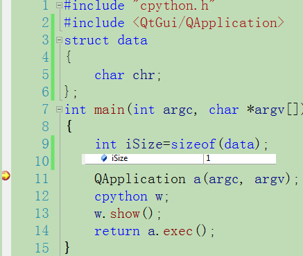
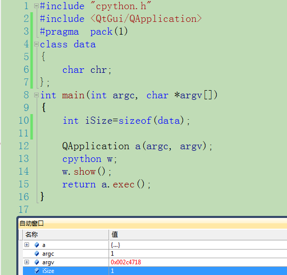
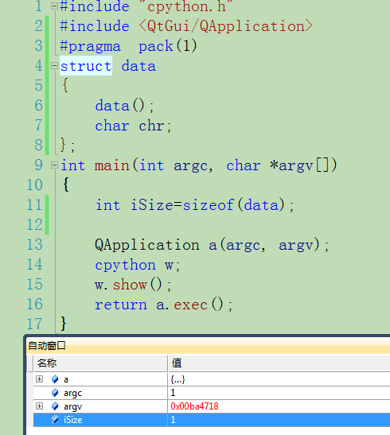
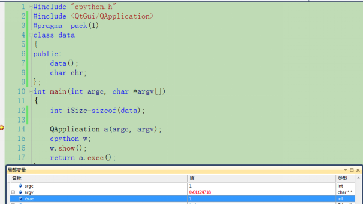
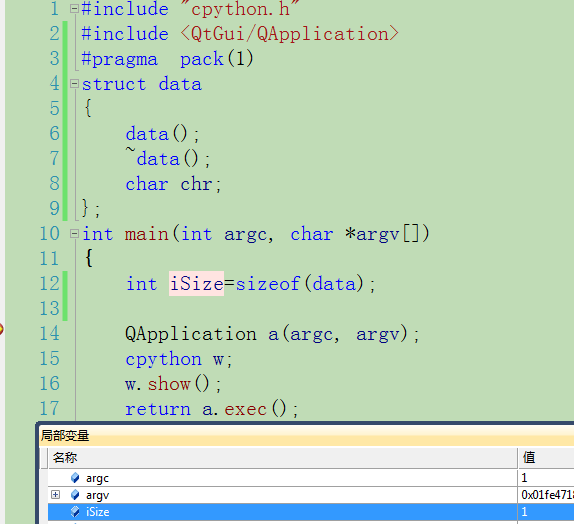
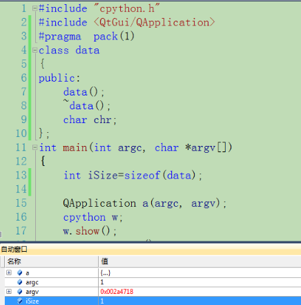
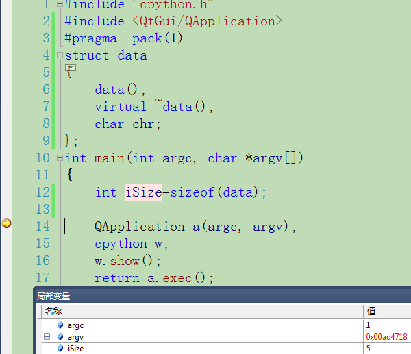
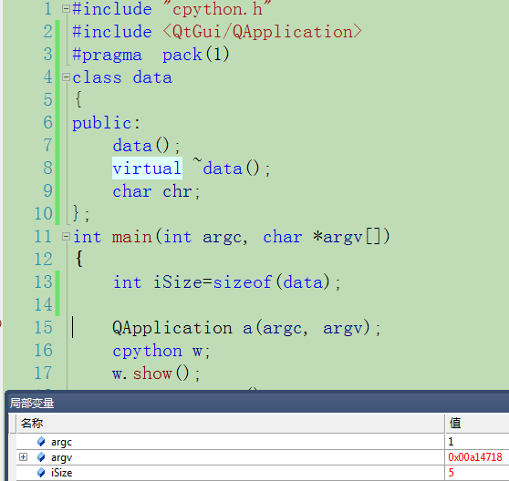
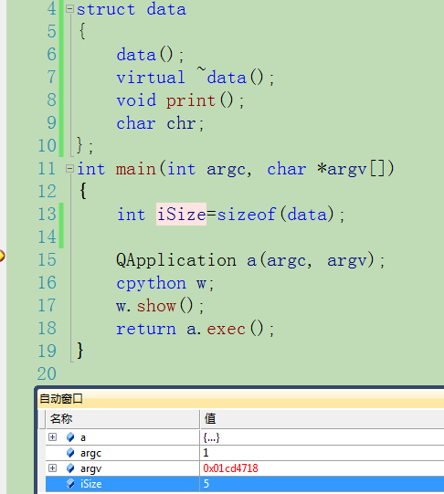
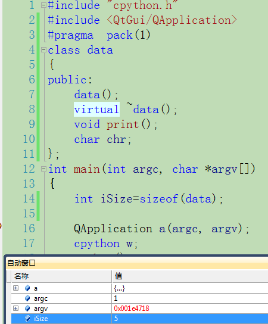
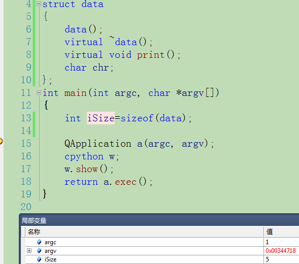
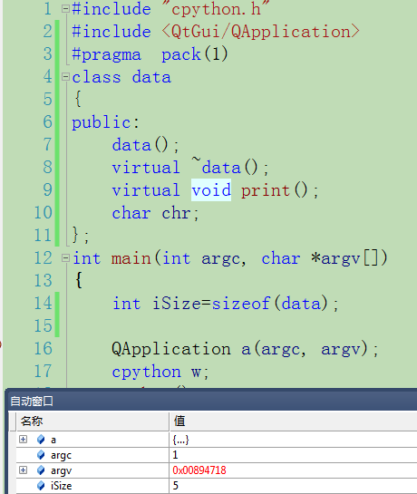

	

	